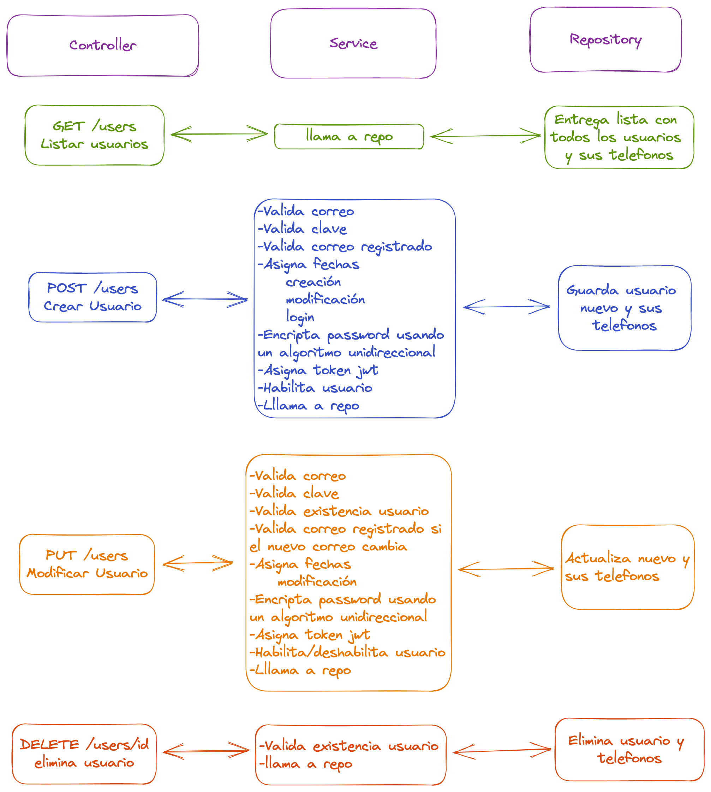

# Nisum Java Test
Proyecto trata de un CRUD para manejo de usarios, las respuestas de las excepciones tienen el sigiente formato:
```json
{"mensaje":"Mensake de error"}
```
La base de datos utilizada es H2 y su estructura se crea cuando se levanta el proyecto (No se necesita script).
Proyecto Realizado en Springboot 3.0.5 y Java 17
## Configurar java 17
Para ello usaremos sdkman, como instalarlo [aqui](https://sdkman.io/install). Una vez instalado sdkman descargamos y seteamos la version de java 17 en nuestro env.
```shell
sdk install java  17.0.5-amzn 
sdk default java  17.0.5-amzn 
```

## Instalar dependencias
```shell
./gradlew build
```
## Correr el proyecto
```shell
./gradlew bootRun
```


# Probar endpoints

## Crear usuario
Si en el request se asigna un UUID se creara el usuario con este id, caso contrario se asignara uno aleatorio. Para validar la de la clave del usuario utilizamos regex que se configura en el [application.properties](./src/main/resources/application.properties) del proyecto. La clave del usuario no es persistida directamente , en su defecto se utiliza un algoritmo unidireccional por razones de seguridad.
#### Sin UUID.
```shell
curl -X 'POST' \
  'http://localhost:8080/api/users' \
  -H 'accept: */*' \
  -H 'Content-Type: application/json' \
  -d '{
  "name": "Juan Rodriguez",
  "email": "juan@rodrigez.org",
  "password": "hunter2",
  "phones": [
    {
      "number": "1234567",
      "citycode": "1",
      "countrycode": "57"
    }
  ]
}'
```
#### Con UUID.
```shell
curl -X 'POST' \
  'http://localhost:8080/api/users' \
  -H 'accept: */*' \
  -H 'Content-Type: application/json' \
  -d '{
  "id": "3fa85f64-5717-4562-b3fc-2c963f66afa6",
  "name": "Christian Caicedo",
  "email": "l4crito@gmail.com",
  "password": "password1",
  "phones": [
    {
      "number": "+593958717611",
      "citycode": "032",
      "countrycode": "+593"
    }
  ]
}'
```
## Modificar usuario
Modifica el usuario existen en base al UUID del request, valida primero la existencia del usuario. Si el correo cambia valida le existencia del nuevo correo.

```shell
curl -X 'PUT' \
  'http://localhost:8080/api/users' \
  -H 'accept: */*' \
  -H 'Content-Type: application/json' \
  -d '{
  "id": "3fa85f64-5717-4562-b3fc-2c963f66afa6",
  "name": "Christian Caicedo",
  "email": "segundo@gmail.com",
  "password": "password1",
  "phones": [
    {
      "id": 0,
      "number": "+593958717611",
      "citycode": "032",
      "countrycode": "+593"
    }
  ],
  "active": false
}'
```
## Listar usuarios
Lista todos los usuarios y sus teléfonos.
```shell
curl -X 'GET' \
  'http://localhost:8080/api/users' \
  -H 'accept: */*'
```
## Eliminar usuario
Elimina un usuario en base a su UUID, valida primero la existencia del usuario.
```shell
curl -X 'DELETE' \
  'http://localhost:8080/api/users/3fa85f64-5717-4562-b3fc-2c963f66afa6' \
  -H 'accept: */*' 
```

# Pruebas unitarias
Todas las pruebas unitarias estan hechas en la capa de Servicio (UserServiceImpl) donde se encuentra la gran mayoria de logica de nogocio. Para correr las pruebas ejecutamos:

```shell
./gradlew clean
./gradlew test
```

# Open API (Swagger)
Link para ver la UI the swagger [aqui](http://localhost:8080/api/swagger-ui/index.html).
